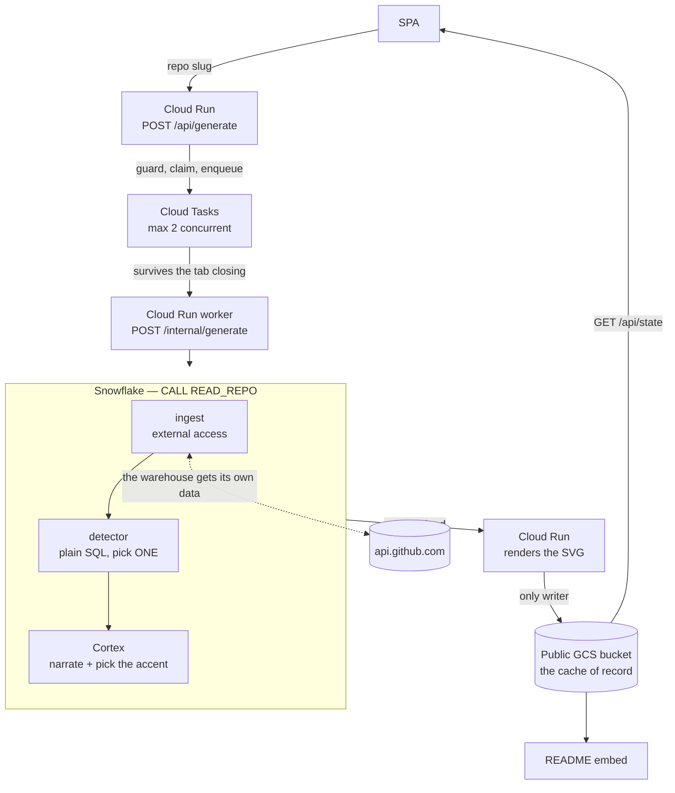
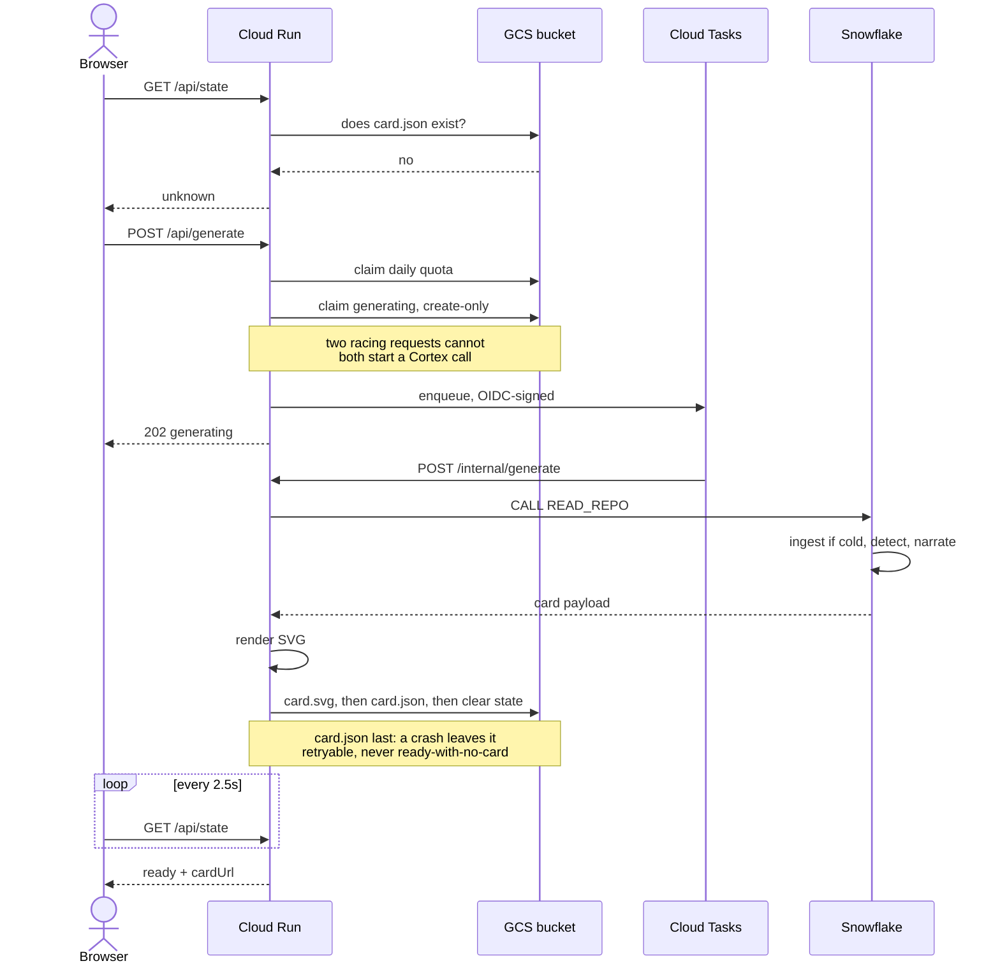

# Commit Chronicles

A contribution graph tells you that work happened. It never tells you _what_ happened.

Paste a public GitHub repo. **Snowflake fetches its own commit history, finds the one story hiding in it with plain SQL, and narrates that single thread with Cortex.** You get a card you can drop into a README.

[](https://github.com/anchildress1/commit-chronicles/actions/workflows/ci.yml) [](LICENSE) [](https://www.conventionalcommits.org/)

**Live:** [commitchronicles.anchildress1.dev](https://commitchronicles.anchildress1.dev) · **Prize target:** Best Use of Snowflake

Three real repos, three storylines the detector found unaided — a **binge**, a **nocturne**, and a **relapse**. Every dot, timestamp, and quoted commit below is real:

[](https://commitchronicles.anchildress1.dev/anchildress1/save-the-sun)

[](https://commitchronicles.anchildress1.dev/anchildress1/carbon-trace)

[](https://commitchronicles.anchildress1.dev/anchildress1/legacy-smelter)

---

## Table of Contents

- [About](#about)
- [Features](#features)
- [Tech Stack](#tech-stack)
- [Architecture](#architecture)
- [The Snowflake case](#the-snowflake-case)
- [Project Structure](#project-structure)
- [Getting Started](#getting-started)
- [Configuration](#configuration)
- [Security](#security)
- [How to Contribute](#how-to-contribute)
- [What's Next](#whats-next)
- [License](#license)
- [Author](#author)

---

## About

Buried in a repo's commit history there is usually exactly one story worth telling. A project that went dark for 107 days and came back at 3:32am. A repo built entirely after midnight whose last commit landed at 3:53 and never got another. A week where every commit was a revert.

Commit Chronicles finds that story with SQL, narrates it with Cortex, and renders it as a 1200×630 SVG sized for a README and a social preview.

The scope is **one repository**, not a whole profile. A year-in-review across a profile turns to mush. A repo has a clean arc: commits start, cluster, pause, restart, or stop.

Two rules hold the product together:

- **Cortex interprets the shape. It never invents the facts.** Every timestamp, count, gap, and quoted message on the card is real and derived from ingested commits. Reading the arc is the product; asserting the author's motivation is not.
- **A repo with no real story says so.** Sparse histories get an honest grey template card, not manufactured drama.

---

## Features

| Feature                         | What it does                                                                                                                                |
| ------------------------------- | ------------------------------------------------------------------------------------------------------------------------------------------- |
| **Repo-first flow**             | Enter a public `owner/repo`, submit once. Generation is keyed by the slug.                                                                  |
| **Durable generation**          | Work runs on a Cloud Tasks worker request, so closing the tab doesn't kill the job. Come back later to `/{owner}/{repo}` and re-attach.     |
| **Six-storyline SQL detector**  | `relapse`, `nocturne`, `binge`, `collapse`, `fight`, `resurrection` — scored deterministically, exactly one winner, plus a `none` fallback. |
| **One Cortex call**             | The winning thread's evidence only, never the whole history. Schema-constrained output.                                                     |
| **Cortex picks the palette**    | The accent hex is a reading of the arc. A repo that died and one that came back and shipped must not wear the same colour.                  |
| **Copyable README embed**       | The card is a public bucket object. Hotlink it from anywhere.                                                                               |
| **Cost guards by construction** | Daily cap, in-flight dedupe, cached failures, queue-level concurrency ceiling, ingest cap.                                                  |

---

## Tech Stack

| Layer                | Choice                                                                                                                            |
| -------------------- | --------------------------------------------------------------------------------------------------------------------------------- |
| **Data + AI engine** | **Snowflake** — external access integration, plain-SQL detector views, `AI_COMPLETE` via a hand-written UDF (`claude-sonnet-4-5`) |
| **Deploy tooling**   | `snow` CLI — every warehouse object is SQL in this repo                                                                           |
| **Backend**          | Node 24 (ESM), TypeScript strict, [Hono](https://hono.dev)                                                                        |
| **Frontend**         | React 19 + Vite (path-driven SPA, no router library)                                                                              |
| **Compute**          | Cloud Run (scale-to-zero, request-billed)                                                                                         |
| **Queue**            | Cloud Tasks (OIDC-signed worker callbacks)                                                                                        |
| **Cache of record**  | Public GCS bucket                                                                                                                 |
| **Tests**            | Vitest + Testing Library, Playwright for E2E                                                                                      |

---

## Architecture

Snowflake does the work. Cloud Run guards the request, calls one stored procedure, turns the returned payload into an SVG, and writes it to the bucket. **It computes no analysis of its own.**



**The card's existence in the bucket _is_ the ready state.** There is no Firestore, no status column, no separate database. `readState` checks for `card.json`; if it's there, the repo is ready.

### The generation path



**The queue is a cost decision.** Cloud Tasks calls back _into_ the service, so the pipeline runs inside a request — CPU is billed only while it works and the service still scales to zero. Detaching the work instead would need `--no-cpu-throttling`, which bills the container for sitting there doing nothing.

---

## The Snowflake case

This is the part that matters for the prize. **The warehouse is the editor, not a bucket the LLM reads from.**

### 1. Snowflake reaches out and gets its own data

An `EXTERNAL ACCESS INTEGRATION` lets a Python stored procedure call `api.github.com` from _inside_ the warehouse. There is no ingestion service, no ETL job, no Cloud Function shovelling JSON.

| Object                             | Type                          | Job                                                                                   |
| ---------------------------------- | ----------------------------- | ------------------------------------------------------------------------------------- |
| `GITHUB_API_RULE`                  | `NETWORK RULE` (EGRESS)       | Let the warehouse out to `api.github.com`                                             |
| `GITHUB_TOKEN`                     | `SECRET`                      | The GitHub token, created out-of-band ([setup docs](docs/snowflake-setup.md))         |
| `GITHUB_API_ACCESS`                | `EXTERNAL ACCESS INTEGRATION` | Binds the rule to the secret                                                          |
| `INGEST_REPO_COMMITS(owner, repo)` | `PROCEDURE` (Python)          | Paginates the REST Commits API into `COMMITS`, classifies bot/AI-assisted rows in SQL |

Ingest caps at **500 commits** by default (hard cap 2000). A longer history sets `windowed`, and the card says so out loud — `last 500 commits · quiet since Feb 25` — because reporting a slice as the repo's whole life is simply false.

### 2. Plain SQL finds the story — no LLM, no cost

`detector.sql` is 15 views and zero AI calls. It scores every candidate storyline and keeps exactly one.

```mermaid
flowchart LR
    accTitle: The SQL detector
    accDescr: COMMITS_CLEAN feeds six storyline views, each gated on a minimum commit count. Their scores union into STORYLINE_SCORES, and REPO_STORYLINE picks the single highest score, breaking ties by drama rank. CARD_EVIDENCE then selects only the winning thread's commit lines for Cortex.

    C["COMMITS_CLEAN<br/>merges and bots dropped"]

    subgraph SC["STORY views — scored, gated, free"]
        direction TB
        R["relapse<br/>gap 30d or more"]
        N["nocturne<br/>half the commits at night"]
        B["binge<br/>streak of 7d or more"]
        X["collapse<br/>a spike, then 90d silent"]
        F["fight<br/>4 reverts inside 7d"]
        S["resurrection<br/>a relapse that shipped"]
    end

    W["REPO_STORYLINE<br/>highest score, ties by drama"]
    E["CARD_EVIDENCE<br/>the winner's lines only"]
    AI["CHRONICLE_CARD<br/>the one Cortex call"]
    NONE["none<br/>grey template card<br/>Cortex never runs"]

    C --> SC --> W
    W -->|"a winner"| E --> AI
    W -->|"nothing clears its floor"| NONE
```



Every storyline gates on `MIN_COMMITS = 15` so bot noise can't win, and scoring is deterministic — the same repo always yields the same story. Thresholds live in one `DETECTOR_CONFIG` view:

```sql
CREATE OR REPLACE VIEW DETECTOR_CONFIG AS SELECT
    15 AS MIN_COMMITS,           30 AS RELAPSE_MIN_GAP_DAYS,
    90 AS ABANDONED_AFTER_DAYS,   7 AS BINGE_MIN_STREAK_DAYS,
     4 AS FIGHT_MIN_COMMITS,     22 AS NIGHT_START_HOUR,
     5 AS NIGHT_END_HOUR,        25 AS EVIDENCE_SHARE_PCT,
    20 AS EVIDENCE_MIN_LINES,   140 AS EVIDENCE_MAX_LINES;
```

The winner is picked with one window function:

```sql
QUALIFY ROW_NUMBER() OVER (
    PARTITION BY f.REPO_OWNER, f.REPO_NAME
    ORDER BY s.SCORE DESC NULLS LAST, s.DRAMA_RANK
) = 1
```

**Surveying a whole history produces a report. Picking one story produces an argument.**

### 3. Cortex narrates _only_ the winning thread

`CHRONICLE_CARD` is a hand-written SQL UDF wrapping `AI_COMPLETE` — one schema-constrained call. Model `claude-sonnet-4-5`, `temperature 0.4`, `max_tokens 2048`.

It is fed `CARD_EVIDENCE`: the winning thread's commit lines, budgeted at **25% of the history, floored at 20 lines and capped at 140**. Never the whole repo. Squash-merge bodies are exploded into individual lines first, so work hidden inside a merge is still visible.

The response schema constrains exactly nine keys:

```json
{
  "kicker": "the death of a side project",
  "headline_upright": "Born in daylight. Last touched at",
  "headline_accent": "3:53 in the morning",
  "headline_trail": ".",
  "label_first": "it begins",
  "label_pivot": "",
  "label_last": "",
  "accent": "#e8a04a",
  "accent_reason": "amber, for a repo that ran hot and went out"
}
```

That is the entire surface area of the writing. **Everything else on the card is composed by the renderer from facts** — the commit count, the status verb, the anchor timestamps, the void-panel gap, the caption. Cortex is never taught to produce a number.

The output is then _verified in SQL_ before it is stored. A bad accent hex, a digit smuggled into a poetic label, or a kicker that just echoes the storyline name gets rejected with `cortex_rejected` — the card is not written.

### 4. Cheap by construction

Detection costs nothing. The LLM sees ~20–140 lines, not twenty thousand. `CHRONICLES_WH` is an XSMALL that auto-suspends after 60 seconds with a 300-second statement timeout. Every Cortex query ID is stored on the card row for cost audit.

> **Not built with Cortex AI Function Studio — deliberately.** The Studio registers functions through `SNOWFLAKE.CORTEX.CREATE_AI_FUNCTION`, which Snowflake documents as internal and subject to change without notice, and its entry points are a Snowsight wizard and the Cortex Code CLI — neither leaves the function in this repo. It emits an ordinary UDF around `AI_COMPLETE` anyway, so we wrote that ourselves. You can read it.

---

## Project Structure

```text
snowflake/            # the app. Every object is SQL, deployed with `snow`.
  schema.sql          #   warehouse, tables, COMMITS_CLEAN, PIPELINE_VERSION
  ingest_pipeline.sql #   network rule, external access integration, ingest proc
  detector.sql        #   15 views: facts, gaps, the six storylines, the winner, the evidence
  ai_functions.sql    #   CHRONICLE_CARD — the AI_COMPLETE wrapper
  read_repo.sql       #   READ_REPO — the single entry point Cloud Run calls
src/
  server/
    app.ts            #   routes
    generate.ts       #   claim → enqueue → run → render → write
    bucket.ts         #   GCS: card.svg, card.json, state.json, quota counters
    queue.ts          #   Cloud Tasks + OIDC verification (inline fallback for laptops)
    snowflake.ts      #   the driver wrapper
    rerender.ts       #   CLI: redraw stored cards, no Cortex spend
    card/             #   SVG renderer — layout, text fitting, formatting
  client/             #   React SPA: Landing, Loading, Result, Failed
  shared/             #   slug parsing, error taxonomy (shared by both sides)
docs/                 # the spec, the build plan, Snowflake account bootstrap
scripts/              # gcp-bootstrap.sh — one-off GCP resources
```

---

## Getting Started

Requires **Node ≥ 24** and, for the warehouse half, the [`snow` CLI](https://docs.snowflake.com/en/developer-guide/snowflake-cli/index).

```bash
make install     # deps + git hooks
cp .env.example .env
make dev         # API on :8080, SPA on :5273
make ai-checks   # format, lint, typecheck, test, build — the full gate
```

Without a Cloud Tasks queue configured, generation runs in-process. **A laptop needs no queue.**

See [`docs/snowflake-setup.md`](docs/snowflake-setup.md) for minting the Snowflake PAT (it's role-locked at creation — that trips everyone once) and the GitHub token.

### Deploying

```bash
make snowflake-deploy   # every warehouse object, in dependency order
make gcp-bootstrap      # bucket, image repo, service accounts, secret, queue (one-off)
make deploy             # build the image, deploy to Cloud Run, prune to 3 revisions
```

`SNOWFLAKE_PAT` lives in Secret Manager and is mounted at run time. `.env` is local-only; nothing in it is baked into an image.

---

## Configuration

| Variable                 | Required | Default                                     | Purpose                                                                                                                                                       |
| ------------------------ | -------- | ------------------------------------------- | ------------------------------------------------------------------------------------------------------------------------------------------------------------- |
| `CARD_BUCKET`            | **yes**  | —                                           | The public GCS bucket. Cards, state, quota counters.                                                                                                          |
| `SNOWFLAKE_ACCOUNT`      | **yes**  | —                                           | Account identifier                                                                                                                                            |
| `SNOWFLAKE_USER`         | **yes**  | —                                           |                                                                                                                                                               |
| `SNOWFLAKE_PAT`          | **yes**  | —                                           | Programmatic access token; role-locked at creation                                                                                                            |
| `SNOWFLAKE_WAREHOUSE`    | no       | `CHRONICLES_WH`                             |                                                                                                                                                               |
| `SNOWFLAKE_DATABASE`     | no       | `CHRONICLES`                                |                                                                                                                                                               |
| `SNOWFLAKE_SCHEMA`       | no       | `RAW`                                       |                                                                                                                                                               |
| `SNOWFLAKE_ROLE`         | no       | `ACCOUNTADMIN`                              |                                                                                                                                                               |
| `PORT`                   | no       | `8080`                                      |                                                                                                                                                               |
| `PUBLIC_ORIGIN`          | no       | `https://commitchronicles.anchildress1.dev` | Used to build the page URL in the README embed                                                                                                                |
| `DAILY_GENERATION_CAP`   | no       | `100`                                       | Hard ceiling on live generations per day                                                                                                                      |
| `GENERATING_TTL_SECONDS` | no       | `600`                                       | After this, an in-flight job is presumed dead and re-admitted                                                                                                 |
| `TASKS_QUEUE`            | no       | —                                           | **All-or-nothing.** Set it and `GOOGLE_CLOUD_PROJECT`, `TASKS_LOCATION`, `WORKER_URL`, `TASKS_INVOKER_SA` all become required. Unset ⇒ in-process generation. |
| `GITHUB_TOKEN`           | no       | —                                           | Only used to mint the Snowflake `SECRET`. **Cloud Run never calls GitHub.**                                                                                   |

---

## Security

- **Cloud Run is the only writer to the bucket.** Client writes are forbidden. The bucket is public-read because hotlinked cards _are_ the product.
- **`/internal/generate` spends Cortex credits, so it verifies OIDC** — the task's token is checked against the invoker service account's email before anything is billed. No token, no work.
- **Path handling denies by default.** `parseSlug` rejects `..`, enforces GitHub's own owner/repo grammar, and runs on both the client and the server. An unparseable slug never reaches the warehouse.
- **Cortex's accent hex is re-verified before it reaches the SVG** (`safeAccent`), even though the response schema already constrains it. The card is public; the hex is untrusted output.
- **Secrets never land in the repo.** `SNOWFLAKE_PAT` is mounted from Secret Manager; the GitHub token exists only as a Snowflake `SECRET` object. `.env` is local-only and git-ignored.
- **Abuse controls:** daily generation cap counted in the bucket (so it holds across instances), create-only claim so two racing requests can't both bill a Cortex call, cached failures for terminal errors, and a queue `max-concurrent-dispatches=2` ceiling on the warehouse spend rate.

---

## How to Contribute

- Branch and PR always. Nothing lands directly on `main`.
- [Conventional Commits](https://www.conventionalcommits.org/), GPG-signed, one logical change per commit.
- AI-authored commits carry a `Generated-by:` footer naming the model that wrote the diff, plus a human `Signed-off-by:`. Commitlint enforces both.
- `make ai-checks` is the gate. Warnings are errors.
- New components and utilities ship with positive, negative, and edge-case tests.

---

## What's Next

- **Embedded font subset.** GitHub proxies README images through camo, so webfonts don't load in the card. The fix is a base64-embedded Didone subset; today the card falls back through a serif stack.
- **A gallery route.** Cut for the deadline — the landing page ships three example chips instead.
- **Auto-regeneration of stale cards.** `STALE_CARDS` already reports which cards were written by a pipeline version that no longer exists. It reports rather than acts, because acting costs a Cortex call each.

---

## License

[PolyForm Shield 1.0.0](LICENSE).

Read it, learn from it, fork it, run it yourself. The one thing you can't do is sell it as a competing product. Poking at the SQL is fine; relabelling this as your own commit-storytelling product is not.

---

## Author

**Ashley Childress** — [@anchildress1](https://github.com/anchildress1)
