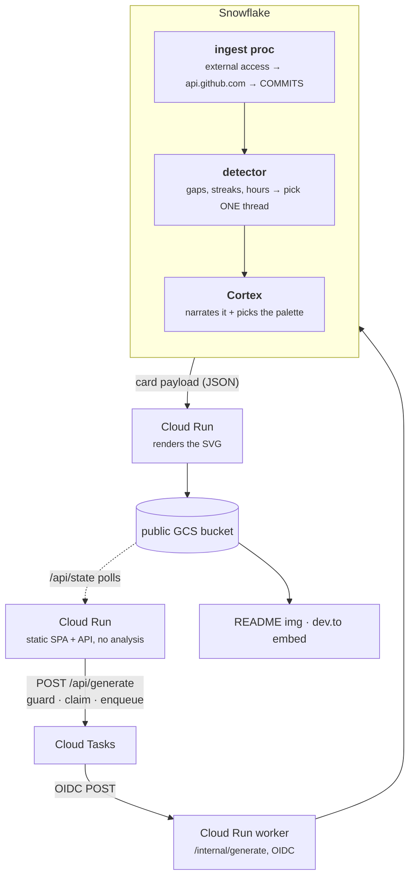

# Commit Chronicles — Build Plan

## TL;DR

- **What:** a shareable card that tells the one real story hiding in a repo's commit history. Drops into a README, embeds in a post.
- **Stack:** Snowflake does the work. A public **GCS bucket** holds the card. **Cloud Run** is a thin shell — it serves the page, pushes the button, and templates the SVG.
- **Built with:** `snow` CLI (every SQL object scripted in-repo) + Snowflake MCP.
- **Prize:** Best Use of Snowflake — the app _is_ Snowflake.
- **Due:** Mon Jul 13, 06:59 UTC.

For the product contract — the card, the voice rules, the renderer/Cortex ownership split — see [`initial-design-spec.md`](initial-design-spec.md). This file is the delivery order and what became of it.

## Architecture



Snowflake gets its own data, finds the story, and reads it. Cloud Run serves the page and API, queues durable work, calls one proc in the worker request, and turns the payload into an SVG. **The card in the bucket is the state** — if the file exists, it is ready. The browser polls `/api/state/{owner}/{repo}`; it never reads the bucket for state.

**Rendering is Cloud Run's job, not Snowflake's.** Templating an SVG proves nothing about a warehouse, and doing it in-warehouse would put a `STORAGE INTEGRATION`, an external stage, and a service-account IAM grant on the critical path for zero narrative gain. Cloud Run has to exist anyway; it writes to GCS with ordinary credentials.

## Tooling

- **Snowflake MCP (self-hosted, `Snowflake-Labs/mcp`)** — object management and SQL orchestration. This is what let Claude create the network rule, secret, integration, and procedures.
- **`snow` CLI** — every object lives as SQL in the repo and deploys with one command (`make snowflake-deploy`). Reproducible, reviewable, and it's what the writeup screenshots.

## Snowflake objects (the whole app)

| object                                              | job                                                             | status     |
| --------------------------------------------------- | --------------------------------------------------------------- | ---------- |
| `GITHUB_API_RULE` (EGRESS, `api.github.com`)        | let the warehouse out                                           | ✅ shipped |
| `GITHUB_TOKEN` (`SECRET`)                           | GitHub token; created out-of-band, never in a tracked file      | ✅ shipped |
| `GITHUB_API_ACCESS` (`EXTERNAL ACCESS INTEGRATION`) | binds rule + secret                                             | ✅ shipped |
| `COMMITS` · `REPO_INGEST` · `INGEST_STAGE`          | commit rows, ingest metadata, pre-classification staging        | ✅ shipped |
| `PROC INGEST_REPO_COMMITS(owner, repo)`             | Python + external access → REST Commits API → `COMMITS`         | ✅ shipped |
| `COMMITS_CLEAN` (view)                              | drops merges + bots, derives date/hour parts                    | ✅ shipped |
| `DETECTOR_CONFIG` (view)                            | every threshold in one place                                    | ✅ shipped |
| detector views (15)                                 | facts, gaps, six storylines, scores → one winner                | ✅ shipped |
| `COMMIT_LINES` (view)                               | explodes squash-merge bodies so buried work is visible          | ✅ shipped |
| `CARD_EVIDENCE` (view)                              | the winning thread's lines — all Cortex ever sees               | ✅ shipped |
| `CHRONICLE_CARD` (UDF)                              | hand-written `AI_COMPLETE` wrapper; one schema-constrained call | ✅ shipped |
| `CARD_PLOT` (view) · `CARDS`                        | the scatter array; the stored payloads + Cortex query ids       | ✅ shipped |
| `PIPELINE_VERSION` · `STALE_CARDS` (views)          | hash the deployed prompt; report cards a dead pipeline wrote    | ✅ shipped |
| `CARD_PAYLOAD` (view) · `REFRESH_CARD_DATA()`       | zero-cost read path; re-derive facts/plot without re-billing    | ✅ shipped |
| `PROC READ_REPO(owner, repo)`                       | the one entry point: ingest if cold → detect → Cortex → verify  | ✅ shipped |

No `STORAGE INTEGRATION` and no external stage — Cloud Run owns the bucket.

## Stage 1 — the detector (plain SQL, no LLM, free)

Score candidate threads, pick the single most dramatic **true** one. Six storylines, all gated on `MIN_COMMITS = 15`:

- **relapse** — `LAG` over commit dates: quiet ≥ 30 days, then resumed.
- **nocturne** — ≥ 50% of commits in the night window (22:00–04:59 UTC).
- **binge** — a consecutive-active-day streak ≥ 7 days.
- **collapse** — silent ≥ 90 days, with ≥ 15% of all commits crammed into the final 30 days before the silence.
- **fight** — ≥ 4 revert/hotfix commits inside a 7-day window (regex; no AI needed).
- **resurrection** — a relapse that also shipped a release after the pivot. Scores relapse + 15.

Highest score wins; ties break by drama rank (`resurrection` > `collapse` > `relapse` > `nocturne` > `fight` > `binge`). Floors keep bots and noise from winning. Deterministic — same repo, same story.

**A repo where nothing clears its floor gets `none`**: a grey template card, written without ever calling Cortex.

## Stage 2 — Cortex (one small call)

Feed **only the winning thread's evidence** — 25% of its commit lines, floored at 20 and capped at 140, plus the first 5 and last 8 — alongside the computed facts. Model: `claude-sonnet-4-5`.

It returns exactly nine keys:

```json
{
  "kicker": "the death of a side project",
  "headline_upright": "Born in daylight. Last touched at",
  "headline_accent": "3:53 in the morning",
  "headline_trail": ".",
  "label_first": "it begins",
  "label_pivot": "",
  "label_last": "",
  "accent": "#e8a04a",
  "accent_reason": "amber, for a thing that burned out"
}
```

All the writing on the card, and nothing else. The italic run sits inside sentence 2 — `headline_upright` is upright, `headline_accent` is italic and in the accent colour, `headline_trail` is upright again. Empty labels for the anchors this storyline doesn't use.

**Cortex picks the palette.** One `accent` hex paints every accent-coloured element on the card. A project that died and one that shipped must not wear the same colour.

**The model is not trusted.** The output is verified in SQL before it is stored — a bad hex, a digit in a poetic label, or a kicker that just parrots the storyline name is rejected and no card is written. `label_pivot` and `label_last` are overwritten structurally when the storyline has no pivot or the repo isn't active.

**Renderer owns the facts.** Kicker slug prefix, header meta (`59 COMMITS · QUIET SINCE FEB 25`), first/last-commit anchor prefixes, void-panel text, caption, author handle — all composed from `FACTS`, `STATUS`, `PIVOT_AT`, and the `PLOT` array. See the Ownership section in `initial-design-spec.md` for the full split.

## Stage 3 — the card

Cloud Run templates an SVG (1200×630) from the Cortex JSON plus the plotted commits, and writes it to the public GCS bucket.

**Design:**

- Didone headline in three slots — upright, italic accent fragment, upright · mono kicker naming the genre · status label (`abandoned` / `dormant` / `active`).
- **The arc is the card:** beeswarm scatter, date across and hour down, night at the bottom. Daylight commits hollow, night commits solid. The dead stretch is a **void panel** you look through. The final commit is one accent dot.
- Poetic tails pin to the anchors the storyline uses. The headline **interprets** — that's the point.

## Cost

Detection is free SQL. Cortex sees at most 140 lines, not thousands of commits — and never sees a `none` repo at all. Cloud Run scales to zero. Storage is a bucket. A hard daily cap and a queue that admits two jobs at a time bound the worst case. Ballpark: **lunch money, once.**

## Timeline (as delivered)

- **Fri night — THE GATE.** MCP + `snow` CLI connected. Two things proven before anything else was allowed to matter: external access can reach `api.github.com` from inside a proc, and Cortex AISQL runs in the region.
- **Sat AM** — ingest → `COMMITS` for one repo.
- **Sat PM** — detector SQL. It picked the intended storylines unaided.
- **Sun AM** — Cortex call via `READ_REPO`; Cloud Run renders the SVG → GCS.
- **Sun PM** — Cloud Run shell + `/api/generate`; card confirmed rendering in a real README.
- **Sun night** — writeup: the detector SQL, the Cortex call, the `snow` deploy. Cards are the demo.
- **Mon early** — submit with buffer.

## Open items

- **Font rendering in the SVG** — GitHub proxies README images through camo, so webfonts won't load. Fix is a base64-embedded subset. **Deferred by decision**; the card falls back through a serif stack.
- **Anonymous serving** — Snowflake will not answer an anonymous HTTP request (SPCS "public" endpoints are RBAC-gated; a browser gets a login page). The public GCS bucket is the answer. **Resolved.**
- **Async generation** — Cloud Tasks owns the durable worker request. The page polls `/api/state`, so closing the tab does not affect the job. **Resolved.**
- **Stale cards** — `STALE_CARDS` reports which cards a dead pipeline version wrote. It does not act, because acting costs a Cortex call each. `make cards-rerender` redraws stored cards with a new renderer for free; only a prompt change needs real spend.

## Cut

1. **The gallery page.** Three example chips on the landing page cover the same need.
2. Extra story types beyond the six — none were needed.

**Never cut, and wasn't:** external-access ingest · the detector SQL · the Cortex call including the palette pick · the SVG card · the writeup showing the SQL.
