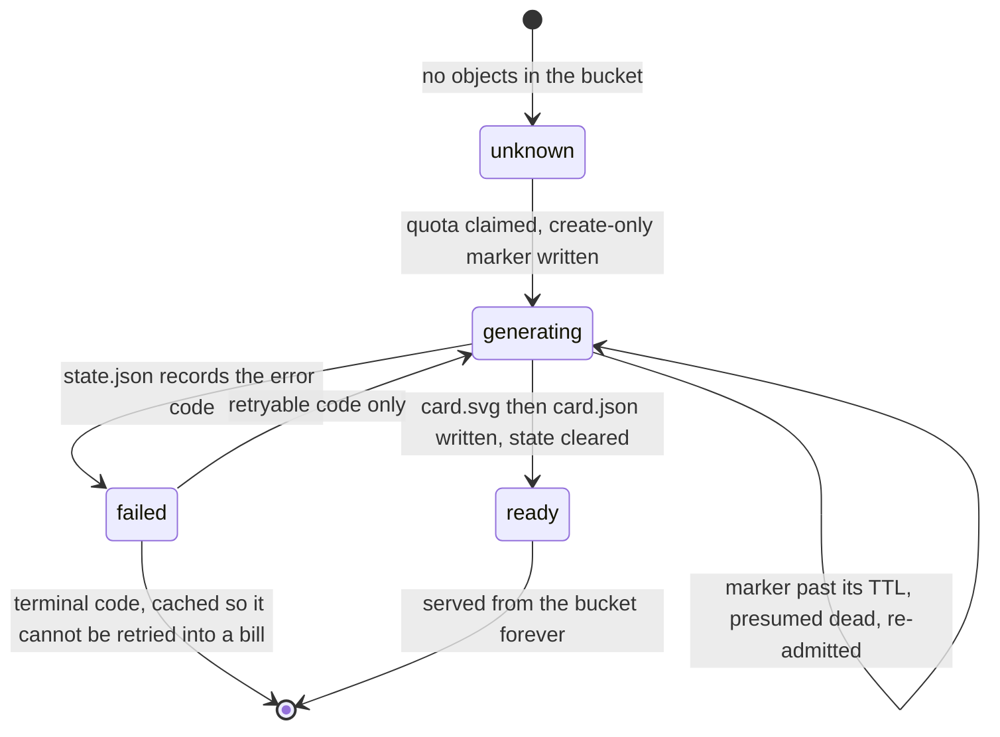
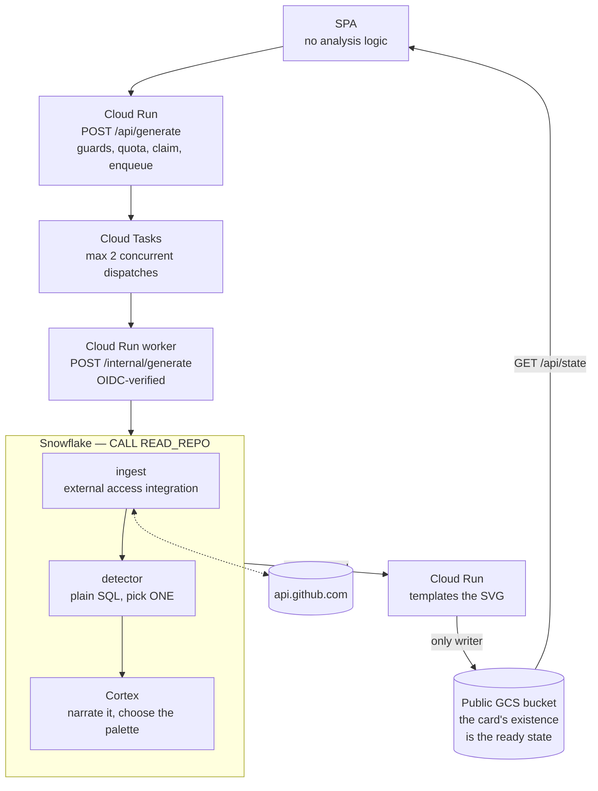

# Commit Chronicles — V1 Spec

_DEV Weekend Challenge: Passion Edition. Prize target: **Best use of Snowflake**. Due Mon Jul 13, 6:59 AM UTC._

This document describes the shipped system. Where the original design was cut or changed, it says so rather than describing a product that does not exist.

## Thesis

A contribution graph tells you that work happened. It never tells you what happened. Buried in a repo's commit history is usually exactly one story worth telling — a project that went dark for 107 days and came back at 3:32am, a repo built entirely after midnight whose last commit landed at 3:53 and never got another, a week where every commit was a revert.

Commit Chronicles finds that one story with SQL, narrates it with Cortex, and renders it as a card you can paste into a README.

Scope is **one repository**, not a whole profile. A profile year-in-review turns to mush; a repo has a clean arc — commits start, cluster, pause, restart, or stop.

**The product is the card. The site exists to make one.**

## What ships (V1)

- A repo entry flow for public GitHub repos (`owner/repo` or a URL).
- A durable generation state: `generating`, `ready`, `failed`.
- A generated SVG card sized for README and social previews.
- A copyable Markdown embed.
- A cached public page at `/{owner}/{repo}` and a card served directly from the public GCS bucket.
- Three pre-generated example repos on the landing page, for judge-safe demo coverage.

**Cut:** the gallery route. Three example chips on the landing page cover the same need — a judge who wants a card without waiting for one — at a fraction of the surface area.

## The card

1200×630 SVG, readable as a standalone artifact.

- **Product mark** — `Commit Chronicles`.
- **Kicker** naming the genre — `the death of a side project`, `the one that came back` — prefixed with the repo slug.
- **Headline** — Didone serif, in three slots: upright, then an italic accent-colored fragment, then upright again. The italic run may start mid-sentence.
- **The arc** — a beeswarm scatter: date across, hour of day down, rotated so night sits at the bottom of the frame. Daylight commits render hollow, night commits solid. Long quiet stretches render as a **void panel** you look straight through. The last commit is a single accent dot.
- **Anchor labels** — a poetic tail on the first commit, the pivot, and the last commit. Only the anchors this storyline actually uses get one.
- **Status** — an observed label: `abandoned`, `dormant`, `active`.
- **Counts** — commits, span.
- **Attribution** — `Read by Snowflake Cortex`.

If the card would work equally well as a bar chart, it has failed.

## Voice rules

**Have an opinion.** A card that only describes is a report, and nobody shares a report. The whole product is the sentence that says what the shape _means_ — "the commits got later and later, and then they stopped." Write that sentence.

- **Interpret the arc. Never invent the facts.** Every timestamp, count, gap, and quoted message is real and derived from the ingested commits. Read the shape freely; do not manufacture events.
- **Quote the commit messages.** They're the author's own words and they're the best material on the card. A repo that ends on `fix: rp my release please token readonly` at 3:53am tells you more than any adjective.
- **Editorial, dry, literary.** Short sentences. It can be unsparing without being cruel, and confident without being hyperbolic.
- No praise, no hype, no emoji, no exclamation marks. Restraint in tone; boldness in claim.
- If the history genuinely has no story, say that. Don't manufacture drama out of six commits.

## User flow

1. User enters a repo. The client normalizes the slug and rejects a malformed one before any request.
2. The client reads `GET /api/state/{owner}/{repo}` **first**.
3. `ready` → render the cached card immediately. `POST /api/generate` is never called.
4. A settled `failed` state with a terminal error code also stops here — retrying it would only re-buy the same failure.
5. Otherwise the client calls `POST /api/generate` **once**. Cloud Run claims a daily-quota slot and a `generating` marker, then enqueues.
6. The user can wait or leave.
7. Cloud Tasks calls `/internal/generate`. Snowflake returns the card payload; Cloud Run renders the SVG and writes it to the bucket (or records `failed`).
8. The client polls state every 2.5s until it settles, and gives up displaying progress after five minutes — the job itself is unaffected.
9. Returning to `/{owner}/{repo}` finds the existing card and renders it.
10. User copies the card image URL or the README embed.

The browser tab must not be required for generation to complete. If it is, the app is a loading spinner wearing a trench coat.

### Job state

State is not a column in a database. **The card's existence in the bucket _is_ the ready state.**



`readState` checks for `card.json` first, so a card always outranks a stale `state.json` beside it. The accent hex rides on the object's custom metadata, so polling never downloads the payload.

**Terminal error codes** (cached, no retry offered): `repo_not_found`, `repo_private`, `repo_empty`, `invalid_repo_slug`, `no_commits`.
**Retryable:** `cortex_empty`, `cortex_rejected`, `pipeline_error`.

## Product surface (ready state)

- Repo address, normalized as `commitchronicles.anchildress1.dev/{owner}/{repo}`.
- Large card preview, loaded straight from the bucket.
- Primary action: **Copy image URL**.
- Secondary action: **Copy README embed**.
  ```md
  [](https://commitchronicles.anchildress1.dev/{owner}/{repo})
  ```
- Link to read another repo.

The whole page takes its accent colour from the card's — Cortex picks the palette for the site, too.

## Data source

The GitHub REST **Commits API** — `/repos/{owner}/{repo}/commits`. Public repos only.

**Do not use the Activity Events API.** GitHub stripped commit summaries and counts from `PushEvent` payloads on 7 Oct 2025, which also guts every GH-Archive mirror of it. Commit text now survives only in the main REST API.

Ingest: commit message, SHA, authored timestamp, author login when public. **Cap: 500 commits** per repo by default, hard-capped at 2000. Bot and AI-assisted commits are classified at ingest and filtered before anything expensive runs.

A history longer than the cap sets `windowed`, and the card admits it — the header reads `last 500 commits · quiet since Feb 25` rather than presenting a slice as the repo's whole life.

The Snowflake Marketplace archive is not used in V1. This product is about one submitted repo and its Cortex reading, not whole-population percentile math.

## Architecture



**Generation goes through a queue, and that is a cost decision.** The work has to outlive the browser tab. Detaching it from the request that started it would need Cloud Run's `--no-cpu-throttling`, which bills instance time instead of request time — you pay for the container to sit there doing nothing. Cloud Tasks calls back into the service, so the pipeline runs _inside_ a request: CPU is billed only while it is working, the service still scales to zero, and closing the tab has no effect on a job that is no longer attached to the tab's connection. The queue's `max-concurrent-dispatches=2` is the real ceiling on the Cortex spend rate — at most two repos can be in the warehouse at once, whatever the front page is doing.

`/internal/generate` is on a public service, so it verifies the task's OIDC token against the invoker service account before it spends anything. No token, no work.

- **Snowflake** reaches GitHub itself via an external access integration, finds the story in SQL, and narrates it with Cortex. The ingest layer is a stored procedure, not a service.
- **Cloud Run** owns the routes, calls one Snowflake proc, and turns the returned payload into an SVG. It fetches no commit data and computes no analysis.
- **The GCS bucket** is the cache of record and serves cards directly. Cloud Run serves the SPA and `/api/state`; a cached render never calls Snowflake or GitHub.

**Rendering lives in Cloud Run, not Snowflake.** Templating an SVG string is a chore, not a demonstration of a data warehouse — and doing it in-warehouse would drag a `STORAGE INTEGRATION`, an external stage, and a Snowflake-minted service-account IAM grant onto the critical path to buy nothing. The Snowflake case rests on the ingest, the detector, and the Cortex call. Cloud Run writes to the bucket with ordinary GCP credentials.

Snowflake cannot serve an anonymous HTTP request — SPCS "public" endpoints are RBAC-gated and hand a browser a login page. The public GCS bucket serves the card; Cloud Run serves the page and API.

### Routes

| Route                           | Guard | Job                                                                  |
| ------------------------------- | ----- | -------------------------------------------------------------------- |
| `GET /healthz`                  | —     | Liveness                                                             |
| `POST /api/generate`            | —     | Claim and enqueue. `202` accepted, `200` attach, `429` quota spent   |
| `POST /internal/generate`       | OIDC  | The worker. Calls Snowflake, renders, writes. **Spends the credit.** |
| `POST /internal/rerender`       | OIDC  | Redraws one stored card with the current renderer. No Cortex spend.  |
| `GET /api/state/{owner}/{repo}` | —     | Job state. `no-store`. The only thing the client polls.              |
| `GET /` · `GET /{owner}/{repo}` | —     | The SPA shell                                                        |

There is deliberately **no card route**. The bucket is public and serves the SVG itself.

### Bucket layout

| Object                            | Cache-Control          | Job                                                  |
| --------------------------------- | ---------------------- | ---------------------------------------------------- |
| `cards/{owner}/{repo}/card.svg`   | `public, max-age=3600` | The product                                          |
| `cards/{owner}/{repo}/card.json`  | `public, max-age=300`  | The payload. **Its existence is the ready state.**   |
| `cards/{owner}/{repo}/state.json` | `no-store`             | `generating` or `failed`. Deleted on success.        |
| `meta/quota/{YYYY-MM-DD}.json`    | `no-store`             | The daily counter, so the cap holds across instances |

Writes are ordered `card.svg` → `card.json` → clear `state.json`. A crash between the first two leaves the repo retryable rather than ready-with-no-card.

## Snowflake objects

Every object is SQL in the repo, deployed with the `snow` CLI. An object created by clicking in a UI does not exist.

| object                                              | job                                                                                        |
| --------------------------------------------------- | ------------------------------------------------------------------------------------------ |
| `CHRONICLES_WH`                                     | XSMALL, auto-suspend 60s, 300s statement timeout                                           |
| `GITHUB_API_RULE` (EGRESS, `api.github.com`)        | let the warehouse out                                                                      |
| `GITHUB_TOKEN` (`SECRET`)                           | GitHub token. Created out-of-band — see `docs/snowflake-setup.md`, never in a tracked file |
| `GITHUB_API_ACCESS` (`EXTERNAL ACCESS INTEGRATION`) | binds rule + secret                                                                        |
| `INGEST_REPO_COMMITS(owner, repo)`                  | Python proc + external access → Commits API → `COMMITS`                                    |
| `INGEST_STAGE`                                      | transient staging table; an owner's-rights proc cannot create a temp table                 |
| `COMMITS`                                           | owner, repo, sha, subject, body, authored_at, bot/AI flags                                 |
| `REPO_INGEST`                                       | per-repo ingest metadata: `WINDOWED`, `COMMIT_CAP`, `INGESTED_AT`                          |
| `COMMITS_CLEAN` (view)                              | drops merges and bots; derives date + hour parts                                           |
| `DETECTOR_CONFIG` (view)                            | every threshold the detector uses, in one place                                            |
| detector views                                      | facts, gaps, six `STORY_*` views, scores → `REPO_STORYLINE`                                |
| `COMMIT_LINES` (view)                               | explodes squash-merge bodies into line items; drops trailers and stub lines                |
| `CARD_EVIDENCE` (view)                              | the winning thread's lines — the only thing Cortex sees                                    |
| `CHRONICLE_CARD` (UDF)                              | hand-written wrapper around `AI_COMPLETE`; one structured call → the whole card            |
| `CARD_PLOT` (view)                                  | the scatter array. Never sent to a model                                                   |
| `CARDS`                                             | the generated card payloads, plus the Cortex query id for cost audit                       |
| `PIPELINE_VERSION` (view)                           | MD5 of the deployed prompt + evidence DDL. Moves on its own when either changes            |
| `STALE_CARDS` (view)                                | cards written by a pipeline version that no longer exists. **Reports; does not act**       |
| `CARD_PAYLOAD` (view)                               | an existing card, in the shape `READ_REPO` returns. The zero-cost read path                |
| `REFRESH_CARD_DATA()` (proc)                        | re-derives `FACTS` and `PLOT` without re-billing Cortex                                    |
| `READ_REPO(owner, repo)` (proc)                     | the one entry point: ingest if cold → detector → `CHRONICLE_CARD` → verify → payload       |

## The detector (plain SQL, no LLM)

This is the core of the product and the core of the Snowflake case. Score every candidate storyline deterministically; keep the highest. Surveying a repo's whole history produces a report. Picking one story produces an argument.

Every storyline gates on `MIN_COMMITS = 15`, so bot noise cannot win.

| storyline        | signal                                                 | gate                                                           |
| ---------------- | ------------------------------------------------------ | -------------------------------------------------------------- |
| **relapse**      | `LAG` over commit dates — quiet, then resumed          | gap ≥ 30 days                                                  |
| **nocturne**     | share of commits in the night window (22:00–04:59 UTC) | ≥ 50% of commits                                               |
| **binge**        | longest consecutive-active-day streak                  | streak ≥ 7 days                                                |
| **collapse**     | a spike, then permanent silence                        | ≥ 90 days silent **and** ≥ 15% of commits in the final 30 days |
| **fight**        | revert/hotfix cluster (regex on the subject — no AI)   | ≥ 4 such commits in a 7-day window                             |
| **resurrection** | a relapse that also shipped a release after the pivot  | inherits relapse's gate, `+15` score                           |
| **none**         | nothing cleared its floor                              | the fallback                                                   |

Thresholds live in one view, so tuning the detector is a one-line diff:

```sql
CREATE OR REPLACE VIEW DETECTOR_CONFIG AS SELECT
    15 AS MIN_COMMITS,           30 AS RELAPSE_MIN_GAP_DAYS,
    90 AS ABANDONED_AFTER_DAYS,   7 AS BINGE_MIN_STREAK_DAYS,
     4 AS FIGHT_MIN_COMMITS,     22 AS NIGHT_START_HOUR,
     5 AS NIGHT_END_HOUR,        25 AS EVIDENCE_SHARE_PCT,
    20 AS EVIDENCE_MIN_LINES,   140 AS EVIDENCE_MAX_LINES;
```

The winner is one window function — highest score, ties broken by how dramatic the storyline is (`resurrection` > `collapse` > `relapse` > `nocturne` > `fight` > `binge`):

```sql
QUALIFY ROW_NUMBER() OVER (
    PARTITION BY f.REPO_OWNER, f.REPO_NAME
    ORDER BY s.SCORE DESC NULLS LAST, s.DRAMA_RANK
) = 1
```

Scoring is deterministic: the same repo always yields the same story.

**`none` never reaches Cortex.** It writes a hard-coded grey template card (`#6b7280`, `MODEL = 'none'`) and costs nothing. A history with nothing to say gets told so.

Cheap, explainable, and it means Cortex is only ever pointed at the part that matters.

## Cortex

One call, fed **only the winning storyline's evidence**. Never the whole history — that's how you buy an expensive, unfocused paragraph.

**The evidence budget is measured in lines, not commits**: 25% of the winning thread's commit lines, floored at 20 and capped at 140, plus the first 5 and last 8 lines regardless. `COMMIT_LINES` explodes squash-merge bodies into separate items first, so work buried inside a merge is still visible; trailers and stub lines are dropped.

Model: `claude-sonnet-4-5` via `AI_COMPLETE`, `temperature 0.4`, `max_tokens 2048`.

**Temperature is 0.4 on purpose, and must not be dropped to 0.** Determinism belongs to the detector, and it has it — the same repo always yields the same storyline, the same evidence, and the same facts. Cortex's only job is the phrasing, and a zero-temperature model phrases every repo identically: the same cadence, the same safe adjective, the same card. Restraint in tone is a voice rule, not a sampling parameter. Every fact is pinned before the call and re-verified after it, so the only thing warmth can move is the writing — which is the part that has to be worth sharing.

The response schema constrains exactly nine keys:

```json
{
  "kicker": "the death of a side project",
  "headline_upright": "Born in daylight. Last touched at",
  "headline_accent": "3:53 in the morning",
  "headline_trail": ".",
  "label_first": "it begins",
  "label_pivot": "",
  "label_last": "",
  "accent": "#e8a04a",
  "accent_reason": "amber, for a repo that ran hot and went out"
}
```

Nine keys. That is the whole surface area of the writing on the card — **not** the card payload, which is a 22-key camelCase object wrapping these nine alongside the facts, the plot, the storyline, the query id, and the pipeline version.

**The italic run is a fragment, not a clause.** The renderer sets `headline_upright` upright, `headline_accent` italic and in the accent colour, `headline_trail` upright again. The italic can start mid-sentence — that's the design. Punctuation may live in `accent` or `trail`; put it where the typography looks right.

**Cortex chooses the palette.** One `accent` hex paints every accent-coloured element on the card: kicker slug, italic headline fragment, last-commit dot, arrow, void-panel rule, attribution bullet. It is a reading of the arc, not a brand constant: a repo that went quiet and a repo that came back and shipped must not wear the same colour.

The palette is **muted neons** — bright but not fluorescent, saturated but not raw. Anchor hues on the spectrum:

| hex       | family      | reads as                 |
| --------- | ----------- | ------------------------ |
| `#e8a04a` | muted amber | burn, heat, ember        |
| `#e56b5a` | muted coral | conflict, alarm, warning |
| `#d3e85a` | muted lime  | return, growth, life     |
| `#7fe4c5` | muted mint  | cool, dawn, calm         |
| `#6ab5f5` | muted sky   | night, distance, quiet   |

Cortex may drift slightly off these anchors — the constraint is the family, not the exact swatch. No greys, no browns, no fluorescents, no deep saturated primaries. `none`-storyline cards use grey (`#6b7280`) deliberately; that colour is reserved for "no story to tell".

Narration constraints: use only the supplied facts and invent nothing — then say what they mean (see Voice rules).

### The model is not trusted

The schema constrains shape, not content, and constrained decoding does not support length or pattern constraints. So the output is **verified in SQL before it is stored**, and a card that fails is not written:

| check                                     | reject reason             |
| ----------------------------------------- | ------------------------- |
| `accent` is not a `#rrggbb` hex           | `accent_hex_invalid`      |
| a digit smuggled into a poetic label      | `label_*_has_digits`      |
| the kicker just echoes the storyline name | `kicker_echoes_storyline` |

The renderer then re-verifies the hex anyway (`safeAccent`) on the way into the SVG, because the card is public and the hex is untrusted output.

Two labels are also **overwritten in SQL after the model returns**, because they are structural, not editorial:

- `label_pivot` → `''` when the pivot is null or lands on the last commit. A collapse has no separate pivot.
- `label_last` → `''` whenever the repo is not `active`. For an abandoned repo the renderer prints `last commit · <time>`, and a poetic tail on top of that reads as filler.

### Status

Three observed labels, derived from `daysSinceLast`:

| `daysSinceLast` | `statusLabel` | header verb       |
| --------------- | ------------- | ----------------- |
| ≥ 90            | `abandoned`   | `ABANDONED SINCE` |
| ≥ 30            | `dormant`     | `QUIET SINCE`     |
| otherwise       | `active`      | `LAST TOUCHED`    |

These thresholds are literals in `read_repo.sql`, not `DETECTOR_CONFIG` entries. Changing the detector config will not move them.

### Ownership: renderer vs Cortex

Cortex writes the words the reader hears in the author's voice. The renderer composes everything else from `FACTS`, `STATUS`, `PIVOT_AT`, and the `PLOT` array. Do not teach Cortex to produce any of these.

| element on the card                                    | source                                                                                              |
| ------------------------------------------------------ | --------------------------------------------------------------------------------------------------- |
| Kicker slug prefix `ATLAS/PIPELINE — ` (accent)        | `REPO_OWNER/REPO_NAME`, uppercased                                                                  |
| Kicker genre (neutral)                                 | Cortex `kicker`                                                                                     |
| Header meta `<N> COMMITS · <VERB> <MMM DAY>`           | `FACTS.commitCount` + status verb map + `FACTS.lastCommitAt`                                        |
| Header meta, windowed `LAST <N> COMMITS · …`           | as above, when `FACTS.windowed` — the slice must not read as the whole life                         |
| Headline (upright / italic / upright)                  | Cortex `headline_upright`, `headline_accent`, `headline_trail`                                      |
| First-commit anchor `<TIME> · <DATE> — <label>`        | `FACTS.firstCommitAt` + Cortex `label_first`                                                        |
| Pivot anchor (drawn only when `label_pivot` non-empty) | `pivotAt` + Cortex `label_pivot`                                                                    |
| Last-commit anchor                                     | if `label_last` empty: `last commit · <TIME>`. Else: Cortex `label_last`.                           |
| Void panel (two lines)                                 | `FACTS.largestGap.days` + `FACTS.largestGap.from/to`, formatted `MMM DAY`                           |
| Caption                                                | fixed: `Every dot is one commit, placed by the hour it landed. The last one was <TIME>, <MMM DAY>.` |
| Author handle at foot-right                            | `FACTS.primaryAuthorLogin`                                                                          |
| Product mark, `Read by Snowflake Cortex`, corner rule  | constants                                                                                           |
| Accent colour everywhere                               | Cortex `accent`                                                                                     |

Times are read against the commit's **own UTC offset**, never the server's zone. The 3:53am ending is the product; a timezone conversion would move it.

Plot annotation pinning: the renderer matches `FACTS.firstCommitAt`, top-level `pivotAt`, and `FACTS.lastCommitAt` against `plot[].t` (exact `TO_VARCHAR(AUTHORED_AT)` string) to find the dots those anchors ride.

## Why it wins "Best use of Snowflake"

- Snowflake **reaches out and gets its own data** — external access integration, no ingestion service.
- Plain SQL — window functions, gaps, streaks, histograms — **finds the story**. The warehouse is the editor, not a bucket the LLM reads from.
- Cortex narrates the one thread and picks the palette — and its output is verified in SQL before it is trusted.
- Cheap by construction: detection costs nothing; the LLM sees at most 140 lines, not twenty thousand commits.

Show the SQL in the writeup. Do not bury the expensive toy after buying it.

## Cost and abuse controls

Implemented:

- Detection is plain SQL. Cortex only ever sees the winning thread, and never sees a `none` repo at all.
- A ready card short-circuits generation entirely; the bucket serves everything else.
- Cloud Run scales to zero, request-billed, `max-instances 1`.
- Ingest caps at 500 commits (hard cap 2000); longer histories are windowed, not rejected.
- Hard daily generation cap (`DAILY_GENERATION_CAP`), counted in the bucket so it holds across instances. Exhausted → `429`.
- Create-only claim (`ifGenerationMatch: 0`): two racing requests for one cold repo cannot both bill a Cortex call.
- In-flight dedupe with a TTL, so a dead job is re-admitted rather than wedging a repo forever.
- Terminal `failed` states are cached — a bad repo cannot be retried into a bill.
- Queue `max-concurrent-dispatches=2` bounds the warehouse spend rate.
- Smallest viable warehouse, 60s auto-suspend, 300s statement timeout.
- Cortex query IDs stored on the card row for cost audit.
- Quota rollback when queue admission definitively fails; an _ambiguous_ failure deliberately leaves the claim standing, so the TTL reaps it rather than risking a second paid run.
- Example cards are pre-generated.

Deliberately absent:

- **No repo-size rejection.** A large repo is windowed to its newest 500 commits, which costs the same as a small one. Rejecting it would buy nothing.
- **No per-IP rate limit.** The daily cap is the ceiling. A public, unauthenticated `POST /api/generate` protected only by a global counter is a known and accepted trade for a weekend build.

## Known caveats

1. GitHub proxies README images through camo, so webfonts will not load in the card. Fonts must be base64-embedded as a subset; today the card falls back through a serif stack. **Open.**
2. The beeswarm offsets commits horizontally to avoid overplotting. The hour is exact; the day is accurate to within the cluster width. Disclosed in the caption.
3. A quiet or merge-heavy repo may have no story. Said plainly — sparse repos get the `none` template card, not forced Cortex prose.
4. Generation takes tens of seconds. Acceptable, because the result is durable and revisit-safe.
5. README embeds need stable image rendering and cache headers, or the neat trick becomes a broken badge. Cards are served `public, max-age=3600`.
6. The night window is **UTC**, not the author's local time. A nocturne is a nocturne in UTC. Committing at 23:00 in Sydney does not read as one.

## Labels

Project **Commit Chronicles** · repo `commit-chronicles` · route `/{owner}/{repo}` · card object `https://storage.googleapis.com/commit-chronicles-cards/cards/{owner}/{repo}/card.svg` · state endpoint `/api/state/{owner}/{repo}` · generation endpoint `/api/generate`.
